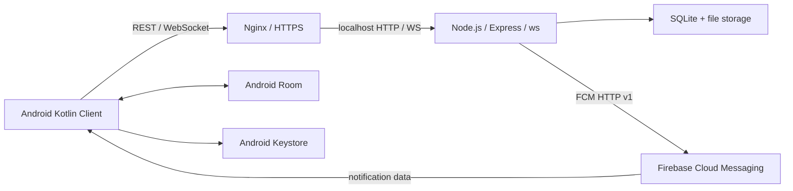
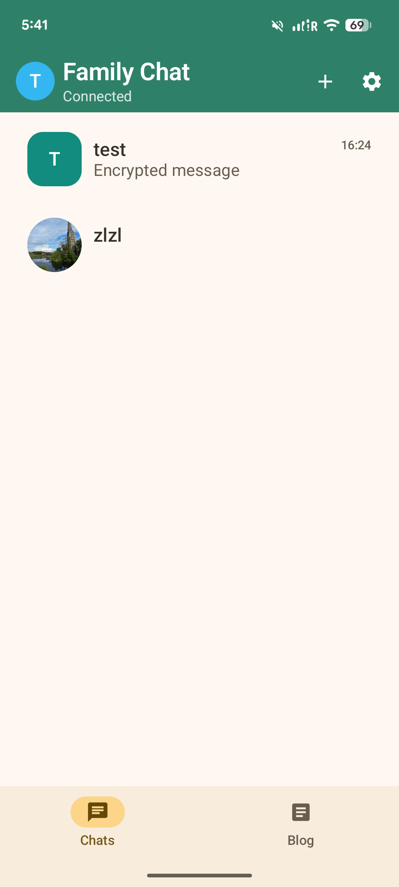
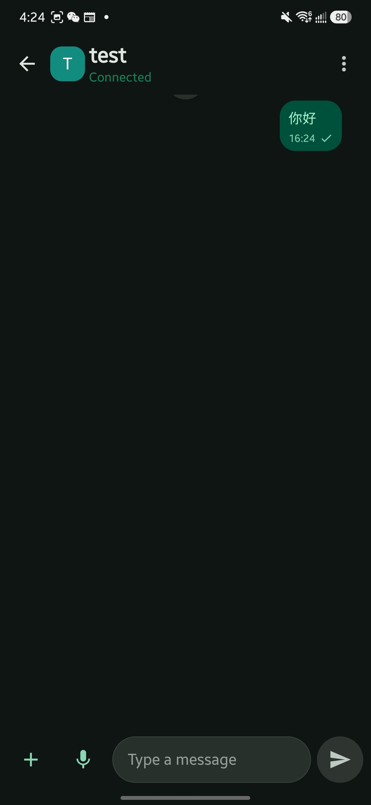
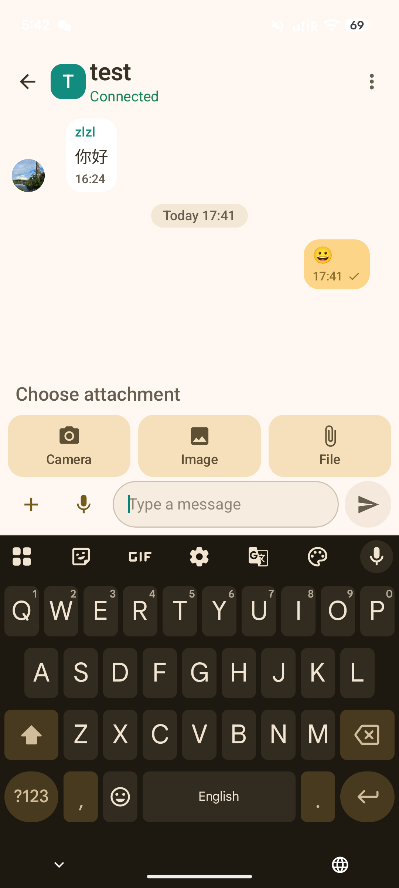

# Family Chat

## Overview

Family Chat is a self-hosted Android chat application with a Kotlin client and a Node.js backend. REST endpoints handle authenticated requests and message submission, while WebSocket events deliver messages and receipts in real time. SQLite persistence, an Android Room cache, a persistent outbox, and Firebase Cloud Messaging support synchronization and notifications.

## Features

- Direct and group messaging, contact requests, and group membership controls.
- REST message submission, WebSocket delivery, and paginated/incremental history retrieval.
- Room-backed conversation/message caches, drafts, and a persistent outbox with retry and server-side idempotency.
- Delivered/read receipts and local notification mute settings.
- Optional client-side encryption for text; client-side encrypted image, file, and voice-note attachments.
- FCM message notifications, token maintenance, and push diagnostics.
- Password authentication, refresh-token rotation, and device approval/revocation.

Encryption is a custom implementation with known gaps. It is **not an independently audited E2EE system**; see [Security](docs/security.md).

Blog, the management portal, APK updates, WebRTC voice calls, and benchmark code remain available but are outside the core messaging showcase. The browser chat in `familychat_web/public/` is **legacy and disabled** by the current server. There is no Windows client implementation in this repository.

## Architecture



The backend is a modular single-process application, not a distributed messaging cluster. See [Architecture](docs/architecture.md) for module boundaries and storage details.

## Message Flow

**Send:** UI → optional client text encryption → Room outbox → REST POST → SQLite → WebSocket broadcast → receiver Room → optional client decryption.

Text encryption currently occurs **before** the message enters the outbox. Attachments are staged locally and encrypted during outbox processing. Successful submission reconciles the server message with the local entry; retries reuse the client message ID.

**Push:** server → FCM HTTP v1 → Android notification. Normal chat pushes carry message/conversation IDs and a generic unread notification, not the message body or encryption keys.

See [Message flow](docs/message_flow.md) for login/registration, history recovery, retries, and receipt semantics.

## Tech Stack

| Area | Technologies |
| --- | --- |
| Android | Kotlin, Jetpack Compose, coroutines/StateFlow, Room, OkHttp, WorkManager, Android Keystore, Firebase Messaging; retained WebRTC call module |
| Backend | Node.js 20, Express, ws, SQLite/better-sqlite3, JWT/jsonwebtoken, bcrypt, multer |
| Deployment | Linux, systemd, Nginx, HTTPS/TLS |

The Gradle wrapper and Android dependency versions are checked in. Builds use JDK 21, compile SDK 36.1, and Android API 26 or newer.

## Screenshots

Real screenshots supplied by the project owner:

| Conversation list · light | Direct chat · dark | Attachment picker · light |
| --- | --- | --- |
|  |  |  |

These show actual UI states, not a security verification or a completed attachment-transfer test. See [screenshot notes](screenshots/README.md).

## Running Locally

### Node.js backend

Prerequisites: Node.js **20.12 or newer within major 20**, npm, and build tools if the native SQLite/bcrypt dependencies need compilation.

From the repository root:

```bash
cp .env.example .env
cd familychat_web
npm ci
node --env-file=../.env server.js
```

On PowerShell, use `Copy-Item .env.example .env` for the copy. Replace the local-only bootstrap password in `.env` before starting. Node loads the file explicitly; `npm start` alone only reads variables already in the process environment. Relative data paths assume the working directory is `familychat_web/`.

The API listens on `127.0.0.1:3000`. Open `http://localhost:3000` for the **management portal**, using the bootstrap credentials in your own `.env`. The example sets `MANAGE_HOST=localhost`, `TRUST_PROXY_HOPS=0`, disables Blog, and leaves FCM unconfigured. Remove both bootstrap variables after the administrator has been created.

A new user submits a registration request from Android. Approve it in the management portal, retrieve the assigned eight-digit user ID in the app, then log in. A new device remains pending until approved by an existing trusted device or the management portal; the first device needs administrator approval. No shared production account or database is included.

A loopback API check returns an authentication error for an unauthenticated request:

```bash
curl -i -H 'X-FamilyChat-Client: android-app' http://127.0.0.1:3000/api/me
```

Run existing backend checks on disposable data:

```bash
npm test
```

Auth/Blog smoke tests use temporary SQLite databases and loopback servers; external push credentials are explicitly disabled in their child processes. See [Validation](docs/validation.md) for results and what was not exercised.

### Android client

1. Open `familychat_app/` in Android Studio with JDK 21 and Android SDK 36.1 installed.
2. Copy `familychat_app/familychat.properties.example` to ignored `familychat_app/familychat.properties`; replace `serverUrl` with **your own reachable HTTPS test endpoint**.
3. Android Studio creates ignored `local.properties`; a manual SDK-path example is also included.
4. For push, configure **your own** Firebase project using [Firebase instructions](docs/firebase.md). Without it, the app can be built for messaging, but FCM initialization/notifications will be unavailable.
5. Build/install the `betaDebug` variant on an ARM64/ARMv7 device. A release keystore is not needed for debug.

```bash
cd familychat_app
./gradlew :app:assembleBetaDebug
```

Windows uses `gradlew.bat`. The debug APK is under `app/build/outputs/apk/beta/debug/`. You can override the endpoint with `-PfamilychatServerUrl=https://example.com` or the `FAMILYCHAT_SERVER_URL` environment variable; `example.com` is a placeholder, not a running project server. An existing installation's saved URL takes precedence, so use a fresh debug install when changing the default.

**Local Android networking:** the app rejects cleartext HTTP. Do not use `http://127.0.0.1:3000` as the Android endpoint; device loopback points to the device. Expose only your disposable local backend through a developer-controlled HTTPS tunnel, or a test Nginx endpoint whose certificate is trusted by Android. For a tunnel/proxy, set `TRUST_PROXY_HOPS` to match that topology. A self-signed certificate is not automatically trusted. This repository does not include an insecure trust-all TLS bypass or depend on an existing production server.

## Deployment

Run Node.js as a Linux service bound to localhost, put Nginx in front of its HTTP and WebSocket endpoints, and terminate HTTPS with your own certificate. Keep credentials and runtime data outside version control.

[Deployment instructions](docs/deployment.md) and the [Nginx](deploy/nginx.example.conf) / [systemd](deploy/family-chat.service.example) templates use only example hosts and paths. Their structure was compared with a running deployment through read-only SSH inspection; the adapted templates still need validation in your own environment. No reference-server configuration was changed.

## Known Limitations

- Text encryption can be disabled. Plaintext messages and some metadata remain visible to the server.
- Reply previews can expose decrypted text outside the encrypted payload.
- Custom key exchange and ratchet code has identity-verification and key-lifecycle gaps; no claim of Signal compatibility, complete forward secrecy, or protection against a malicious server.
- Chat content fields are encrypted in the local cache, but attachment staging/decrypted exports and the separate Blog cache can contain plaintext.
- Delivered status can come from FCM metadata arrival; it does not prove body synchronization or successful decryption.
- Device approval is a server-side state; login does not prove possession of a device private key.
- Messages normally expire after three days (with group TTL settings); deletion is not a secure erasure guarantee for backups or exports.
- Single-process SQLite/file storage; no HA, load-test results, or measured scalability claim.
- FCM depends on Firebase configuration, device services, notification permissions, and platform delivery conditions.
- Native Android ABIs are ARM64/ARMv7; x86 emulator support is not claimed.

See [Security](docs/security.md) and the [source evidence table](docs/feature_evidence.md).

## Licensing

Licensed under the [MIT License](LICENSE). Third-party dependencies and retained toolchain components keep their own license terms.
