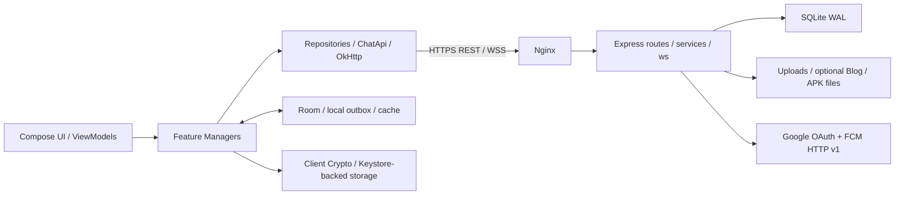

# Architecture

Family Chat consists of an Android app and a modular Node.js monolith. The current browser chat is disabled; the browser-based management portal remains an account/device administration interface.

## System boundaries

## Android

The Gradle projects are `app` and `benchmark`. Feature directories are code organization boundaries, not independently deployed modules. Most Kotlin source files use the `com.example.chat` package even when stored in feature directories.

| Directory | Responsibility |
| --- | --- |
| `di/` | Manual application dependency graph and lazy feature initialization |
| `auth/`, `device/` | Session/token lifecycle, registration, pending device approval and public identities |
| `conversation/` | Conversation summaries, contact requests, groups and member controls |
| `message/` | Message model, Room store, persistent outbox, sync engine, receipts and realtime gateway |
| `crypto/` | Direct-message key agreement/ratchet, group sender keys and content crypto |
| `attachment/` | Staging, encrypted uploads, resume state, download/decryption/export |
| `push/` | FCM token sync, notifications, receipts and diagnostics |
| `ui/`, `navigation/` | Compose screens, ViewModels, navigation and observable state |
| `call/`, `blog/`, `update/` | Retained voice call, feed and APK update features |

[AppContainer](../familychat_app/app/src/main/java/com/example/chat/di/AppContainer.kt) constructs repositories and managers. Room flows feed message and conversation display state; network responses are merged into the store. User lists and some feature state also use StateFlow in memory.

## Backend

[server.js](../familychat_web/server.js) loads configuration, creates the HTTP server and database, assembles services, and registers REST/WebSocket handlers.

- `routes/`: authentication/devices, relationships, conversations, messages/attachments, management, Blog and system endpoints.
- `services/`: session policy, key metadata/device lifecycle, message helpers, groups, calls, retention, releases, Blog and FCM.
- `repositories/`: conversation/user queries, FCM tokens and Blog data access. Other SQL still lives in routes/services.
- `database/`, `lib/`: schema initialization/migrations, SQLite configuration and logging.
- `websocket/`: authenticated upgrades, heartbeat, broadcast, receipts and retained send/call handlers.
- `manage_public/`: active management portal.
- `public/`: legacy browser client assets; current server returns a disabled-chat page instead.

The `X-FamilyChat-Client` header selects client type; it is not a credential. Authentication additionally checks JWT, database session/device status and route-specific authorization.

## Storage

| Store | Content and boundary |
| --- | --- |
| Backend SQLite | Users/password hashes, devices/sessions, conversations, messages, receipts, requests, public keys, key envelopes and FCM tokens |
| Backend file directories | Chat attachment ciphertext, readable avatars, optional Blog media, optional APK releases |
| Android chat Room DB | Encrypted content blobs plus readable indexes/state; conversations, messages, outbox, drafts, decrypted content cache and transfer state |
| Android Blog Room DB | Separate feed cache with plaintext body/comment fields |
| SharedPreferences / Keystore | Settings and UUID; protected tokens/crypto state; Keystore identity signing key |

The default backend DB is `familychat_web/data/chat.sqlite` when no path override is supplied. It uses WAL, foreign keys and versioned schema migrations. The Android chat DB uses Room migrations and WAL; the Blog DB has a destructive cache migration policy.

This is not whole-database encryption: message payload encryption and Android content-blob encryption coexist with readable metadata. See [security](security.md).
