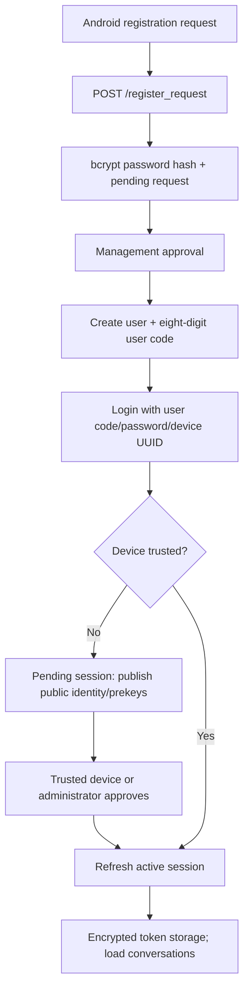
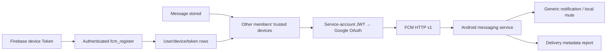

# Message Flow

## Registration, login and device approval



The first device needs administrator approval. The refresh token is random, hashed on the server and rotated on use. Access tokens last 15 minutes; refresh expiry is updated to 30 days during successful refresh.

## Conversation and contact loading

`ConversationManager.refresh` fetches users, conversations, contact requests and group join requests. Conversation summaries are stored in Room. The user directory currently returns all users, including `last_login_ip`; it is not a phone-address-book import or a privacy-filtered contact list. Conversation access is filtered through membership. Approving a contact request creates a direct conversation.

## Text send

```mermaid
sequenceDiagram
    participant UI as Android UI
    participant C as Client Crypto
    participant L as Room Outbox
    participant API as REST API
    participant DB as SQLite
    participant R as Receiver / Room
    UI->>C: Encrypt text if enabled
    C->>L: Pending payload + action + client_message_id
    L->>API: POST /api/messages
    API->>API: Session/device/member/idempotency checks
    API->>DB: Store payload and readable metadata
    API-->>R: WebSocket chat broadcast
    API-->>L: Confirmed server message
    L->>L: Merge confirmed message; remove outbox
    R->>R: Persist; optionally decrypt; render
```

Text encryption happens before enqueueing. The outbox action retains the original text inside an encrypted local blob so the sender can cache its readable content after confirmation. Reply preview and mentions are independent request fields.

Retries preserve the client message ID. A unique server index on user/device/client ID suppresses repeated message creation. Retry attempts are bounded and manual retry is available; this is not an exactly-once distributed transport guarantee. Offline text composition can require previously available key material; this is not an unconditional offline-send guarantee.

## Attachments

Attachments are staged in the app's private files directory. Outbox processing creates a random file key, encrypts the bytes and private metadata, wraps the file key using the direct/group protocol, and uploads ciphertext. The current client uses chunk upload sessions with offsets/checksums and persisted transfer state. The receiver downloads the encrypted file and decrypts locally; materialized cache/export files can be plaintext.

## Receive, history and receipts

WebSocket events are merged into Room before feature events are emitted. UI collectors observe the store. The secure content repository resolves direct/group ciphertext and saves encrypted local readable-content caches.

History recovery uses `GET /api/history` with `since_id` or `before_id`; sync also fetches receipt state. Delivered/read cursors are monotonic server-side conversation state. A foreground visible conversation reports read status.

## Push



Normal chat pushes contain IDs, unread count and generic text, not encrypted body bytes or content keys. Chat push selection does not exclude devices simply because they are connected/foreground. A reported FCM delivery does not prove body retrieval or decryption.

Web Push code, incoming-call events, Blog comment pushes and diagnostics are retained as separate paths.

## Persistence and retention

Messages normally receive a three-day expiry, with configurable group TTL. Periodic maintenance removes expired rows and related files; abandoned upload sessions are cleaned up. This does not guarantee secure deletion from WAL, backups, device caches or exported files.
